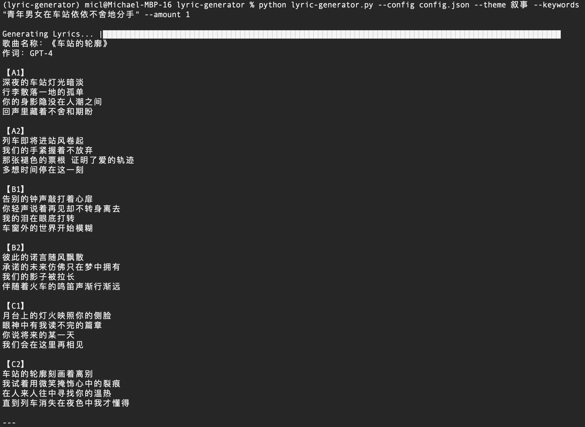

# lyric-generator
Trying to leverage GPT-4 to experiment Chinese lyric generation. For better result, strongly recommend use GPT-4-32K or GPT-4. GPT-4-turbo is not the best one.


## Installation
This tool running under Python >=3.10.

Before install this tool, please apply Azure OpenAI by https://aka.ms/oai/access first. When Azure OpenAI service is ready, please install this tool by below command.
> pip install -r requirements.txt

Please input your Azure OpenAI service information in config.json file.
```json
{
    "openai_url": "<Azure OpenAI service endpoint>",
    "openai_key": "<Azure OpenAI service access key>",
    "deployment":"<Model deployment name>"
}

```

## Parameters

+ --config The JSON configuration file that contains Azure OpenAI service information.
+ --amount The amount of lyrics that user wants to generate.
+ --keywords The tool will generate lyrics around these keywords
+ --theme The theme of the song: 哲思、民谣、叙事、抒情

Below parameters is required when you not specified JSON configuration file.
+ openai_url The Azure OpenAI service endpoint
+ openai_key The Azure OpenAI service key
+ deployment The model deployment name

## Prompt

To generate perfect lyrics by GPT-4, you need to build a very complex prompt. The prompt words are in prompts folder. You can change the content of file to improve lyrics qualification.

